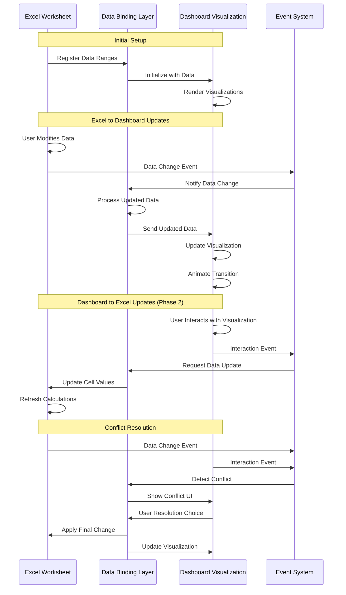

```mermaid
sequenceDiagram
    participant Excel as Excel Worksheet
    participant Binding as Data Binding Layer
    participant Dashboard as Dashboard Visualization
    participant Events as Event System
    
    Note over Excel,Dashboard: Initial Setup
    Excel->>Binding: Register Data Ranges
    Binding->>Dashboard: Initialize with Data
    Dashboard->>Dashboard: Render Visualizations
    
    Note over Excel,Dashboard: Excel to Dashboard Updates
    Excel->>Excel: User Modifies Data
    Excel->>Events: Data Change Event
    Events->>Binding: Notify Data Change
    Binding->>Binding: Process Updated Data
    Binding->>Dashboard: Send Updated Data
    Dashboard->>Dashboard: Update Visualization
    Dashboard->>Dashboard: Animate Transition
    
    Note over Excel,Dashboard: Dashboard to Excel Updates (Phase 2)
    Dashboard->>Dashboard: User Interacts with Visualization
    Dashboard->>Events: Interaction Event
    Events->>Binding: Request Data Update
    Binding->>Excel: Update Cell Values
    Excel->>Excel: Refresh Calculations
    
    Note over Excel,Dashboard: Conflict Resolution
    Excel->>Events: Data Change Event
    Dashboard->>Events: Interaction Event
    Events->>Binding: Detect Conflict
    Binding->>Dashboard: Show Conflict UI
    Dashboard->>Binding: User Resolution Choice
    Binding->>Excel: Apply Final Change
    Binding->>Dashboard: Update Visualization
```