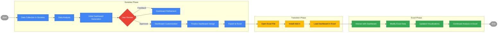

```mermaid
graph LR
    Start([Start]) --> DataCollection[Data Collection in Societas]
    DataCollection --> DataAnalysis[Data Analysis]
    DataAnalysis --> InitialDashboard[Initial Dashboard Generation]
    InitialDashboard --> UserReview{User Review}
    UserReview -->|Feedback| DashboardRefinement[Dashboard Refinement]
    DashboardRefinement --> UserReview
    UserReview -->|Approved| CustomizeDashboard[Dashboard Customization]
    CustomizeDashboard --> FinalizeDesign[Finalize Dashboard Design]
    FinalizeDesign --> ExportToExcel[Export to Excel]
    ExportToExcel --> OpenExcelFile[Open Excel File]
    OpenExcelFile --> InstallAddin[Install Add-in]
    InstallAddin --> LoadDashboard[Load Dashboard in Excel]
    LoadDashboard --> InteractWithDashboard[Interact with Dashboard]
    InteractWithDashboard --> ModifyExcelData[Modify Excel Data]
    ModifyExcelData --> UpdatedVisualizations[Updated Visualizations]
    UpdatedVisualizations --> ContinuedAnalysis[Continued Analysis in Excel]
    ContinuedAnalysis --> End([End])
    
    subgraph SocietasPhase[Societas Phase]
        DataCollection
        DataAnalysis
        InitialDashboard
        UserReview
        DashboardRefinement
        CustomizeDashboard
        FinalizeDesign
        ExportToExcel
    end
    
    subgraph TransitionPhase[Transition Phase]
        OpenExcelFile
        InstallAddin
        LoadDashboard
    end
    
    subgraph ExcelPhase[Excel Phase]
        InteractWithDashboard
        ModifyExcelData
        UpdatedVisualizations
        ContinuedAnalysis
    end
    
    classDef societasPhase fill:#4285F4,stroke:#0D47A1,color:white;
    classDef transitionPhase fill:#FBBC05,stroke:#F57C00,color:black;
    classDef excelPhase fill:#34A853,stroke:#0F9D58,color:white;
    classDef decision fill:#EA4335,stroke:#B31412,color:white;
    classDef endpoint fill:#9E9E9E,stroke:#616161,color:white;
    
    class Start,End endpoint;
    class DataCollection,DataAnalysis,InitialDashboard,DashboardRefinement,CustomizeDashboard,FinalizeDesign,ExportToExcel societasPhase;
    class OpenExcelFile,InstallAddin,LoadDashboard transitionPhase;
    class InteractWithDashboard,ModifyExcelData,UpdatedVisualizations,ContinuedAnalysis excelPhase;
    class UserReview decision;
```