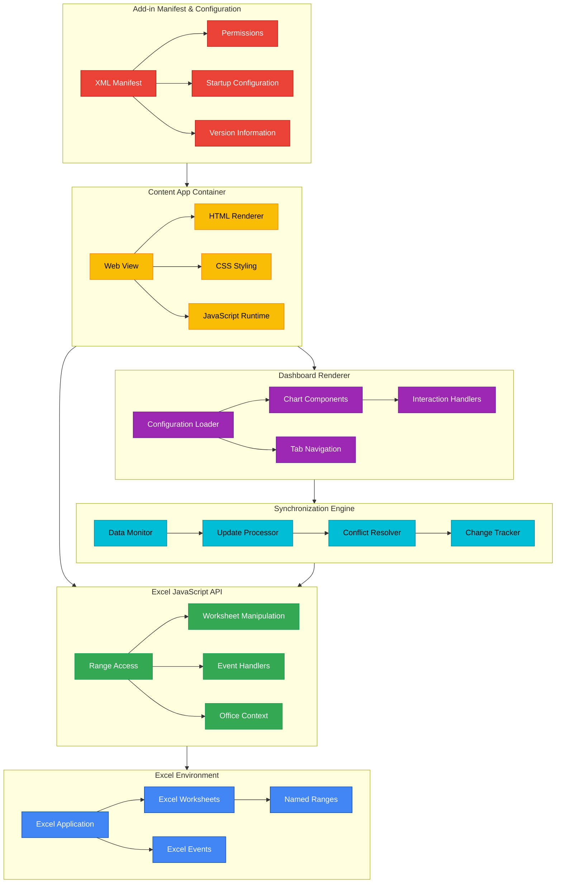

```mermaid
graph TD
    subgraph ExcelEnvironment[Excel Environment]
        ExcelApp[Excel Application]
        Worksheets[Excel Worksheets]
        NamedRanges[Named Ranges]
        ExcelEvents[Excel Events]
    end
    
    subgraph AddinManifest[Add-in Manifest & Configuration]
        Manifest[XML Manifest]
        Permissions[Permissions]
        StartupConfig[Startup Configuration]
        VersionInfo[Version Information]
    end
    
    subgraph ContentApp[Content App Container]
        WebView[Web View]
        HTMLRenderer[HTML Renderer]
        CSSStyles[CSS Styling]
        JSRuntime[JavaScript Runtime]
    end
    
    subgraph ExcelJSAPI[Excel JavaScript API]
        RangeAccess[Range Access]
        WorksheetManipulation[Worksheet Manipulation]
        EventHandlers[Event Handlers]
        OfficeContext[Office Context]
    end
    
    subgraph DashboardRenderer[Dashboard Renderer]
        ConfigLoader[Configuration Loader]
        ChartComponents[Chart Components]
        TabNavigation[Tab Navigation]
        InteractionHandlers[Interaction Handlers]
    end
    
    subgraph SyncEngine[Synchronization Engine]
        DataMonitor[Data Monitor]
        UpdateProcessor[Update Processor]
        ConflictResolver[Conflict Resolver]
        ChangeTracker[Change Tracker]
    end
    
    ExcelApp --> Worksheets
    Worksheets --> NamedRanges
    ExcelApp --> ExcelEvents
    
    Manifest --> Permissions
    Manifest --> StartupConfig
    Manifest --> VersionInfo
    
    WebView --> HTMLRenderer
    WebView --> CSSStyles
    WebView --> JSRuntime
    
    RangeAccess --> WorksheetManipulation
    RangeAccess --> EventHandlers
    RangeAccess --> OfficeContext
    
    ConfigLoader --> ChartComponents
    ConfigLoader --> TabNavigation
    ChartComponents --> InteractionHandlers
    
    DataMonitor --> UpdateProcessor
    UpdateProcessor --> ConflictResolver
    ConflictResolver --> ChangeTracker
    
    AddinManifest --> ContentApp
    ContentApp --> ExcelJSAPI
    ExcelJSAPI --> ExcelEnvironment
    ContentApp --> DashboardRenderer
    DashboardRenderer --> SyncEngine
    SyncEngine --> ExcelJSAPI
    
    classDef excelEnv fill:#4285F4,stroke:#0D47A1,color:white;
    classDef manifest fill:#EA4335,stroke:#B31412,color:white;
    classDef container fill:#FBBC05,stroke:#F57C00,color:black;
    classDef api fill:#34A853,stroke:#0F9D58,color:white;
    classDef renderer fill:#9C27B0,stroke:#6A1B9A,color:white;
    classDef sync fill:#00BCD4,stroke:#00838F,color:black;
    
    class ExcelApp,Worksheets,NamedRanges,ExcelEvents excelEnv;
    class Manifest,Permissions,StartupConfig,VersionInfo manifest;
    class WebView,HTMLRenderer,CSSStyles,JSRuntime container;
    class RangeAccess,WorksheetManipulation,EventHandlers,OfficeContext api;
    class ConfigLoader,ChartComponents,TabNavigation,InteractionHandlers renderer;
    class DataMonitor,UpdateProcessor,ConflictResolver,ChangeTracker sync;
```