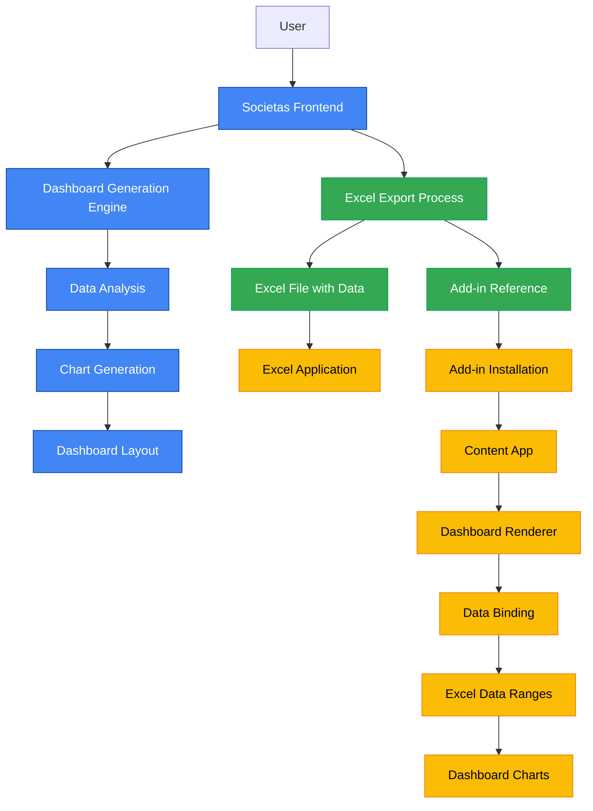

```mermaid
graph TD
    User[User] --> SocietasFE[Societas Frontend]
    SocietasFE --> DashboardEngine[Dashboard Generation Engine]
    DashboardEngine --> DataAnalysis[Data Analysis]
    DataAnalysis --> ChartGeneration[Chart Generation]
    ChartGeneration --> DashboardLayout[Dashboard Layout]
    SocietasFE --> ExcelExport[Excel Export Process]
    ExcelExport --> ExcelFile[Excel File with Data]
    ExcelExport --> AddInRef[Add-in Reference]
    ExcelFile --> ExcelApp[Excel Application]
    AddInRef --> AddInInstall[Add-in Installation]
    AddInInstall --> ContentApp[Content App]
    ContentApp --> DashboardRender[Dashboard Renderer]
    DashboardRender --> DataBinding[Data Binding]
    DataBinding --> ExcelRanges[Excel Data Ranges]
    ExcelRanges --> DashboardCharts[Dashboard Charts]
    
    class SocietasFE,DashboardEngine,DataAnalysis,ChartGeneration,DashboardLayout primaryComponent;
    class ExcelExport,ExcelFile,AddInRef secondaryComponent;
    class ExcelApp,AddInInstall,ContentApp,DashboardRender,DataBinding,ExcelRanges,DashboardCharts tertiaryComponent;
    
    classDef primaryComponent fill:#4285F4,stroke:#0D47A1,color:white;
    classDef secondaryComponent fill:#34A853,stroke:#0F9D58,color:white;
    classDef tertiaryComponent fill:#FBBC05,stroke:#F57C00,color:black;
```